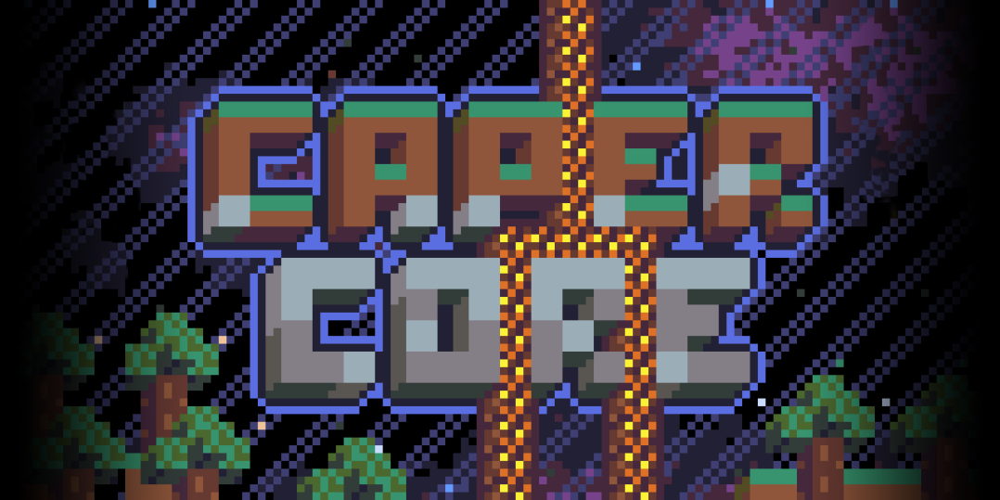

# About
CaperCore is a multiplayer creative voxel game that runs in your browser! The project is being built with customization and modding in mind, so we're actively creating tools to aid content creation.

Read more here:
[Game concept / description](docs/md/Concept.md)

# Play Game
We currently have a public version of the game available to play, though you will still need to find a server or host one yourself if you want to player multiplayer.
[Play Here](http://capercube.com/capercore/)

# Goals
- Fun, more than anything!
- Easily moddable / extendable
- Creative utility - Think mesh exporting or prototyping

## Tech
- Babylon.js (for rendering)
- Node.js (for server)
- Socket.io (for multiplayer)

## Dev Setup & Hosting a Game:
[Dev and Hosting info](docs/md/Setup.md)

## Doc links
For all:
- [Project roadmap](docs/md/Roadmap.md)
- [Game concept / description](docs/md/Concept.md)
- [ScreenShots & media](social/)

For devs:
- [Dev and Hosting info](docs/md/Setup.md)
- [Game ideas](docs/md/Ideas.md)
- [Research needed or completed](docs/md/Research.md)

# Community / Contact
Stop by and say hi! We'd love to hear from ya and share creations!
[SpookyBoogis Discord Server](https://discord.gg/S4VDkFjrE2)

# Contributing
Contact me (CaperCube) about contributing to this project. I do hope to work with more people, but I also want the official code-base to be tidy and easy to use.
[Information for contributors](docs/md/Contribution.md)

# License Note
We offer this project for free and encourage creators of all kinds to modify and share thier creations or derivative works!
This project is listed as MIT and is considered open-source! Please see [the license](LICENSE.md) for details. Don't worry, it's short and easy to read.
